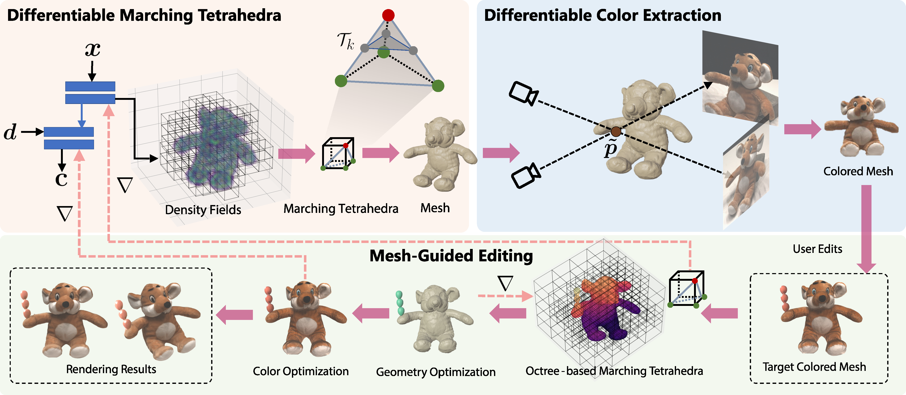

# Mesh-Guided Neural Implicit Field Editing

### [Project Page](https://cassiepython.github.io/MNeuEdit/) | [Paper (ArXiv)](Link)

## Abstract
Neural implicit fields have emerged as a powerful 3D representation for reconstructing and rendering photo-realistic views, yet they possess limited editability. Conversely, explicit 3D representations, such as polygonal meshes, offer ease of editing but may not be as suitable for rendering high-quality novel views. To harness the strengths of both representations, we propose a new approach that employs a mesh as a guiding mechanism in editing the neural radiance field. We first introduce a differentiable method using marching tetrahedra for polygonal mesh extraction from the neural implicit field and then design a differentiable color extractor to assign colors obtained from the volume renderings to this extracted mesh. This differentiable colored mesh allows gradient back-propagation from the explicit mesh to the implicit fields, empowering users to easily manipulate the geometry and color of neural implicit fields. To enhance user control from coarse-grained to fine-grained levels, we introduce an octree-based structure into its optimization. This structure prioritizes the edited regions and the surface part, making our method achieve fine-grained edits to the neural implicit field and accommodate various user modifications, including object additions, component removals, specific area deformations, and adjustments to local and global colors. Through extensive experiments involving diverse scenes and editing operations, we have demonstrated the capabilities and effectiveness of our method.

